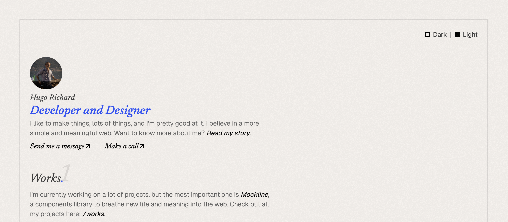

<p align="center">
    <a aria-label="Hugo's Website" href="https://hrcd.fr">
        
  <a aria-label="License" href="https://github.com/hugorcd/hr-folio/blob/master/LICENSE">
    
    </a>
  <a aria-label="Follow Hugo on Twitter" href="https://twitter.com/HugoRCD__">
    
  </a>
</p>

# HR Folio

This is the code for my personal portfolio built with [Nuxt](https://nuxt.com/) and [Tailwind CSS](https://tailwindcss.com/).

## Live website

You can see it live at [hrcd.fr](https://hrcd.fr/).

## Features

- Fully integrated with [Nuxt Content](https://content.nuxt.com/) and using the content driven mode.
- Working contact form with [Resend](https://resend.com/)
- Article & Project Content Type using [Nuxt Content](https://content.nuxt.com/)
- Open Graph Image support with [Nuxt OG Image](https://nuxtseo.com/og-image/getting-started/installation)
- [Nuxt Robots](https://sitemap.nuxt.com/) for auto-generate robots.txt
- [ESLint](https://eslint.org/) using my personal configuration
- Full typescript support
- Optimized images with [Nuxt Image](https://image.nuxt.com/)
- [Vue Composition Collection (Vueuse)](https://vueuse.org/)
- Fully responsive on all modern browsers
- Easy to customize
- Auto generated sitemap

## Quick Setup

1. Clone this repository if you have access or download it from the store
```bash
git clone git@github.com:HugoRCD/hr-folio.git
```

2. Install dependencies
```bash
bun install
```

3. Start development server
```bash
bun dev
```

4. Generate static project
```bash
bun generate
```

5. Start production server
```bash
bun start
```

## How to Modify the Portfolio Content

This portfolio uses [Nuxt Content](https://content.nuxt.com/) to manage the content. Here's how you can modify it:

First check the `app.config.ts` file to change the global configuration of the portfolio, there is a lot of stuff you can change here.

### Writing

1. Navigate to the `content/2.writing` directory.
2. Here, you'll find Markdown files for each article. To modify an article, simply open its Markdown file and make your changes.
3. To add a new article, create a new Markdown file in this directory. The name of the file will be used as the URL slug for the article.

### Works

1. Navigate to the `content/1.works/` directory.
2. Here, you'll find JSON files for each project. To modify an project, simply open its JSON file and make your changes.
3. To add a new project, add a new JSON file in this directory.

### Other Content

Simply go to the `content/` directory and edit any of the Markdown or JSON files to modify the content.

## Setup the Contact Form

This portfolio uses [Resend](https://resend.com/) to handle the contact form. To set it up, follow these steps:
- Get your api key from [Resend](https://resend.com/) here [your api key](https://resend.com/api-keys)
- Add your api key in the `.env` file
- change the `from` key in the `sendEmail` route in the `server/api/` folder, you can customize everything you want in this route
- That's it, you're good to go!

## Setup the Open Graph Image

To change the main open graph image, go to the `app.config.ts` file and change the `openGrapImage` key.
